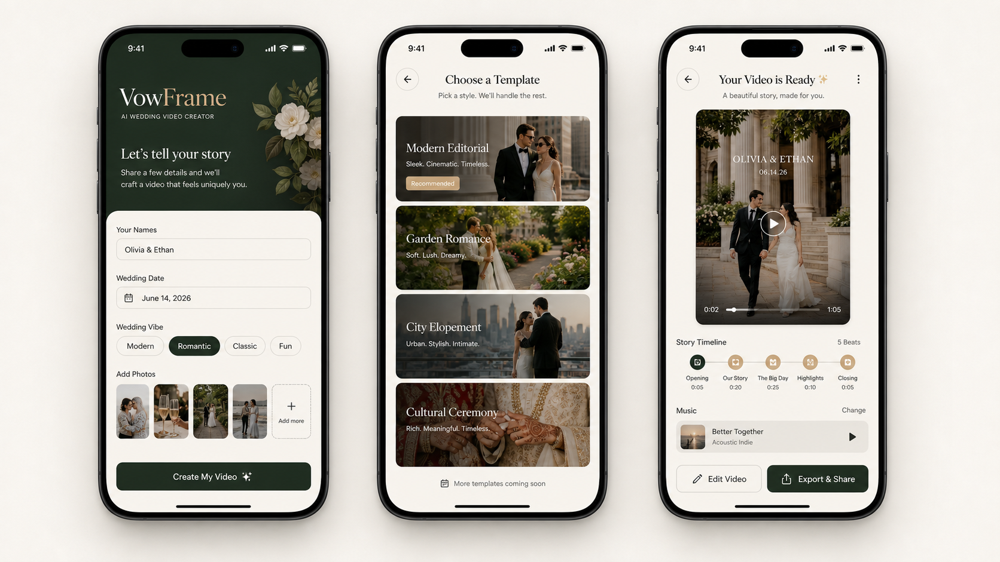

# Wedding Video App 调研报告（美国 iOS 市场）

日期：2026-06-28  
目标：判断是否值得做一款以 wedding video 为主的 iOS app，技术上以 HyperFrames 模板化视频生成为核心，并评估竞争、用户需求、成本策略、端到端视频生成必要性、产品形态和收入空间。

## 结论先行

**可以做，但不建议做成“又一个视频编辑器 / slideshow maker”。**  
更值得验证的方向是：**social-first wedding memory generator**，用用户的真实照片、短视频、誓词、家族故事、朋友视角，先生成一条能在 TikTok / Instagram Reels / 小红书被看完、保存、转发的 15-45 秒情绪短片，再扩展到 Invitation、Reception Slideshow、Thank-you video。MVP 应该以 HyperFrames 确定性模板渲染为主，不要默认依赖端到端视频模型。

商业上，它更像**季节性、事件型、一次性高意愿付费工具**，不是高频订阅工具。合理定价是单片 / 套装 / 导出升级，而不是强推月订阅。

我的判断：

- **值得做一个 MVP**：前提是 4-6 周内做出 10-20 个高质模板、素材上传流程、自动文案和自动成片，并用 TikTok/Instagram/Pinterest/SEO 落地页验证需求。
- **不值得直接重投入端到端 AI 视频**：成本高、稳定性差、人物一致性和婚礼场景真实性风险高。端到端模型只适合做高价增强镜头，例如 3-5 秒 dream shot、venue background、animated couple portrait。
- **赚钱上限中等，不是大 App Store 自然量生意**：如果只靠 App Store 搜索，可能一年几千到几万美元净收入；如果能吃到 wedding planner / photographer / content creator 渠道和社媒传播，年净收入可以到 10-50 万美元级；更高需要 B2B 或模板平台化。

## 1. iOS 市场竞争压力

### 1.1 App Store 竞争结构

2026-06-28 抽样美国区 Apple iTunes Search API，关键词覆盖 `wedding invitation video maker`、`wedding slideshow maker`、`video maker music editor`。

观察到三层竞争：

| 层级 | 代表 | 评分量级 | 判断 |
| --- | --- | ---: | --- |
| 婚礼视频邀请垂类 | Wedding Invitation Video Maker、Video Invitation Maker Ecards | 0-161 到 1,092 ratings，少数 7,000+ | 垂类搜索不算拥挤，但也说明自然需求和分发弱 |
| 邀请/RSVP 平台 | Greetings Island、Evite、Paperless Post | 45,508 / 511,492 / 125,799 ratings | 强品牌、强场景，偏邀请与 RSVP，不是视频故事 |
| 泛视频/Slideshow 编辑器 | SlideShow Maker、Splice、Filmora、YouCut、Add Music to Video | 4 万、5 万、10 万、42 万+ ratings | 真正强竞争；不能正面打“视频编辑器” |

关键竞品数据摘录：

- `Wedding Invitation Video Maker`：1 rating / 5.0，2026-05-01 更新。
- `Wedding Invitation Video Maker`：3 ratings / 3.67，2026-02-20 更新。
- `Invitation Maker 2026`：1,092 ratings / 4.42。
- `Invitation Maker, RSVP Tracker`：7,120 ratings / 4.86。
- `Invitation Maker: Cards & RSVP`：45,508 ratings / 4.89。
- `SlideShow Maker: Music & Video`：39,800 ratings / 4.49。
- `SlideShow Maker with Music Fx`：52,741 ratings / 4.57。
- `SlideShow Maker Photo to Video`：104,002 ratings / 4.24。
- `Splice - Video Editor & Maker`：424,678 ratings / 4.60。

结论：**婚礼视频垂类本身竞争不算红海，但 App Store 搜索流量小；泛视频编辑和邀请平台非常强。** 如果产品只叫 Wedding Video Maker，很容易被泛工具淹没。要用“婚礼故事自动成片”“不用剪辑”“给婚礼当天和社媒传播用”做差异。

### 1.2 Web/模板平台竞争

Canva、Adobe Express、Kapwing、Renderforest 等都覆盖 wedding invitation、wedding template、slideshow/video maker 场景。它们的优势是模板多、编辑器成熟、品牌强；弱点是流程仍偏“自己编辑模板”，没有足够婚礼垂直的故事编排、素材缺失提醒、自动节奏、家庭/文化仪式结构。

机会点不是“模板数量更多”，而是：

- 自动问用户“这条视频为什么值得看”：外婆婚纱、私人誓词、第一眼反应、朋友视角、家族传统、混乱舞池等。
- 自动识别素材是否足够：reaction、heirloom/detail、guest POV、vow/toast audio、family history、party texture。
- 自动生成多版本：TikTok/Reels 15-45s、XHS cover-friendly 版本、Private family 60s、Reception screen 60-90s。
- 支持美国年轻用户正在偏好的真实审美：phone POV、camcorder texture、nostalgia、friend-shot BTS、caption-led storytelling。
- 输出适合 iMessage、Instagram Reels、TikTok、XHS、wedding website、reception screen 的尺寸和压缩版本。

## 2. 美国市场用户需求到底是什么

美国婚礼市场足够大。The Wedding Report 显示 2025 年美国约 2,011,044 场婚礼、婚礼服务支出约 661.6 亿美元；Zola 2026 First Look Report 称平均婚礼成本连续第二年约 36,000 美元；The Knot 2026 Real Weddings Study 称 2025 年结婚夫妇平均婚礼成本约 34,200 美元。这个市场付费能力存在，但购买窗口短、决策压力高。

用户不是泛泛地“想做视频”，而是有几个明确 job：

1. **Save the Date / Invitation video**  
   需要快速、漂亮、可发短信和社交平台。核心是日期、地点、风格、RSVP 链接，不需要复杂剪辑。

2. **Reception slideshow**  
   婚礼现场播放 60-180 秒照片视频，常见痛点是照片太多、排序麻烦、音乐版权和节奏难调。

3. **Social recap / content creator 替代品**  
   美国婚礼内容创作者趋势说明新人越来越重视短视频和社媒传播。App 可以提供低价替代：把朋友拍的照片/视频自动整理成 15-45 秒 recap。

4. **Thank-you / anniversary video**  
   婚后发给宾客或家人，生命周期可以延伸到 anniversary，但频次仍低。

5. **跨文化/家庭仪式视频**  
   美国市场有大量跨文化婚礼。模板若支持 Indian wedding、Jewish wedding、Chinese tea ceremony、Latin wedding、Black church wedding、LGBTQ+ wedding，会比泛模板更有垂直价值，但要避免刻板化。

用户真正要的是：

- 省时间，不想学剪辑。
- 成片要显得“花了心思”，不能像廉价模板。
- 能处理多张照片、几段手机视频、日期地点、名字、誓词、音乐。
- 人物要真实，不要 AI 把新人脸弄坏。
- 可控、可改、可导出高清、可去水印。

## 3. HyperFrames 能否支持用户需求

### 3.1 适合做什么

HyperFrames 的模式是 HTML/CSS/GSAP 组合视频：用 `data-*` 控制片段时间线，用 CSS 做视觉，用 GSAP 做动画，最终渲染成视频。它特别适合：

- 标题卡、日期卡、邀请卡动画。
- 照片/视频 slideshow。
- 多场景模板、转场、字幕、歌词/誓词高亮。
- 竖版 9:16、横版 16:9、方形 1:1 多尺寸输出。
- 确定性渲染，适合反复修改和导出。
- 同一套模板批量替换用户素材。

这正好覆盖 MVP 的核心：**婚礼信息 + 用户素材 + 模板 + 音乐 + 自动时间线 = 成片**。

### 3.2 不适合做什么

HyperFrames 不是端到端视频模型，不会自动生成真实婚礼镜头。它不能原生解决：

- 从文字直接生成一段真实新人婚礼视频。
- 新人脸部一致性、服装一致性、复杂动作。
- 真实摄影机运动中的人物交互。
- 从低质量素材修复成电影级婚礼片。

所以产品承诺必须准确：**“用你的照片和视频生成婚礼故事片”，不是“AI 拍一场婚礼”。**

### 3.3 推荐技术架构

MVP：

- iOS 端：上传照片/视频、填写故事信息、选模板、预览低清版本、支付、导出。
- 后端：素材上传、脚本生成、模板参数生成、渲染任务队列、成片存储。
- HyperFrames：模板渲染、转场、字幕、音乐、导出。
- AI 文本：生成脚本、标题、誓词摘要、scene beats。
- AI 图片：只用于封面、背景纹理、缺失素材替代图，不替换新人真人照片。

## 4. 成本策略

### 4.1 默认低成本路径

默认每个视频尽量走确定性模板渲染：

| 成本项 | 估算 |
| --- | ---: |
| 文案/脚本生成 | 约 $0.01-$0.10 / 单 |
| 图片增强/封面生成 | OpenAI gpt-image-1 公开价格约 $0.011-$0.25 / 张，按质量和尺寸浮动 |
| HyperFrames 渲染 | 主要是服务器 CPU/GPU 时间，若自建队列，短视频可控制在 $0.05-$0.50 / 次 |
| 存储/CDN | $0.01-$0.10 / 用户，取决于保留期和下载量 |
| 支付/App Store 抽成 | 小开发者通常按 15% 规划，保守按 30% 压力测试 |

建议把默认视频 COGS 控制在：

- 15-30 秒：$0.10-$0.60。
- 60-90 秒：$0.30-$1.50。
- 高清多版本导出：$0.80-$2.50。

### 4.2 定价建议

不要主打月订阅。婚礼是一次性事件，用户对订阅敏感，且婚礼结束后容易退款或取消。

推荐：

- 免费：生成 480p 预览，带水印。
- $9.99：单个 15-30 秒 Save the Date / Invitation，1080p 去水印。
- $19.99：单个 60 秒 Wedding Story / Reception Slideshow。
- $29.99-$49.99：Wedding Pack，含 3-5 个版本、多尺寸导出、封面图、RSVP/share link。
- $79-$149：Pro / Planner pack，给摄影师、婚礼策划、content creator 批量使用。

### 4.3 毛利模型

以 $29.99 Wedding Pack 为例：

- Apple 后净收入：$25.49（15% 抽成）或 $20.99（30% 抽成）。
- 默认 HyperFrames 生成成本：$1-$3。
- 支付后毛利：约 $18-$24。
- 若引入端到端视频增强，每个用户多 2-4 段模型视频，成本可能增加 $2-$15+，毛利波动显著。

因此默认包必须能在不用端到端视频的情况下成立，端到端增强必须单独收费。

## 5. 要不要引入端到端生成技术

建议：**MVP 不默认引入；作为付费增强引入。**

原因：

- 婚礼场景对人物真实性极敏感，AI 生成人脸/手/礼服/场地错误会直接破坏信任。
- 用户已经有真实照片和视频，产品更应该“编排真实素材”，而不是替换真实记忆。
- 端到端视频模型成本高、排队慢、不可控，失败重试会吃掉利润。
- App Review、用户隐私和肖像授权也更复杂。

适合引入的地方：

- 3-5 秒非人物强依赖镜头：花束、戒指、venue ambience、邀请背景。
- 用户明确选择的 “AI dream scene” 增强包。
- 静态照片轻动效：parallax、camera move、背景扩图、风格化封面。
- 缺失素材补位：例如没有 venue photo 时生成抽象花园/城市背景。

不建议默认做：

- 生成新人完整婚礼仪式。
- 生成亲友真实人物。
- 自动换脸式婚礼电影。

## 6. 能赚多少钱

这里给三个情景，按美国市场、iOS 为主、自然量 + 小规模投放/社媒估算。实际取决于获客能力，不是技术本身。

### 情景 A：只靠 App Store 搜索，小众工具

- 年下载：20,000-80,000。
- 预览到付费转化：2%-5%。
- 付费用户：400-4,000。
- ARPPU：$15-$25。
- 年流水：$6,000-$100,000。
- 扣 Apple 和生成成本后净收入：约 $3,000-$60,000。

判断：能回收小团队 MVP，但不是大生意。

### 情景 B：社媒/SEO 跑通，有几个爆款模板

- 年下载/访问转 app：150,000-500,000。
- 付费用户：5,000-25,000。
- ARPPU：$20-$35。
- 年流水：$100,000-$875,000。
- 净收入：约 $60,000-$550,000。

判断：这是最现实的目标区间。需要模板审美、短视频传播、Pinterest/SEO、婚礼季运营。

### 情景 C：B2B 给 planner / photographer / content creator

- Pro 用户：500-3,000。
- 年 ARPPU：$120-$300。
- B2B 年流水：$60,000-$900,000。
- 加上 C 端：可到 $200,000-$1,500,000。

判断：更有长期价值，但产品要支持品牌水印、客户项目、批量导出、模板复用。

我的保守判断：**第一年如果只做 C 端 iOS，目标应设为 $50k-$200k 年流水；做得好、有社媒渠道，才有机会冲 $500k+。** 不建议按百万美元收入规划第一版。

## 7. 产品基本形态

产品名暂定：`VowFrame`。

一句话：**Turn real wedding moments into a social reel people actually watch.**

核心流程：

1. 选择用途：POV Recap / Guest Cam / Nostalgia Love Story / Reception Screen。
2. 填信息：名字、日期、地点，以及这条视频的“可转述细节”。
3. 上传素材：照片、短视频、誓词、toast、朋友手机素材、家族老照片或仪式细节。
4. AI 生成 social story system：first-frame hook、timestamp beats、shot list、missing assets、platform plan、edit rules。
5. 选模板：Wedding POV Recap、Guest Camcorder、Nostalgia Love Story、Reception Screen Cut。
6. 低清预览。
7. 支付导出：去水印、高清、多比例、多版本。

必须有的差异化：

- First-frame hook：先找到一句朋友愿意继续看的具体故事，而不是泛泛的浪漫开场。
- 素材检查清单：告诉用户缺什么真实证据，降低模板感。
- 自动多版本：同一素材一键生成 15-45s social cut、60s family cut、reception screen cut。
- 可控编辑：只改文字、顺序、音乐、封面，不做复杂 timeline。
- 真实素材优先：AI 是编排助手，不是替代新人。
- 导出场景明确：TikTok、Instagram Reels、XHS、iMessage、wedding website、reception screen。

## 8. MVP 范围建议

第一版只做 3 个付费场景：

1. Wedding POV Recap 15-45 秒竖版。
2. Guest Camcorder / Nostalgia Love Story 30-45 秒竖版。
3. Reception Screen Cut 60 秒横版。

模板数量：

- 6 个高质模板足够，不要做 50 个低质模板。
- 每个模板支持 2-3 个色板和 2 个尺寸。
- 模板必须预先用真实照片压测文本长度、照片比例和低清素材。

上线前验证指标：

- 上传素材完成率 >= 35%。
- 预览生成完成率 >= 80%。
- 预览到支付 >= 3% 才继续。
- $19.99 单片支付有人买，再做 $29.99 pack。
- 退款/投诉主要集中在画质或模板审美时，先修模板；集中在等待时间时，再优化渲染队列。

## 9. Go / No-Go

Go 条件：

- 你们能做出明显优于廉价 slideshow app 的模板审美。
- 能用 HyperFrames 做稳定、可批量、可复现的成片渲染。
- 获客不只依赖 App Store 搜索，愿意做 TikTok/Pinterest/SEO/wedding creator 合作。
- 默认生成成本能压到 $3 以下。

No-Go 条件：

- 想正面竞争 CapCut/Splice/Filmora。
- 第一版就押端到端 AI 视频。
- 只做模板编辑器，没有自动 story beats 和素材编排。
- 没有分发渠道，只等 App Store 自然下载。

最终建议：**做一个低成本 MVP，有必要；但要按“婚礼故事自动成片 + 真实素材编排 + 付费导出套装”来做，不要按“AI 视频大模型生成婚礼电影”来做。**

## Sources

- Apple iTunes Search API: [`wedding invitation video maker`](https://itunes.apple.com/search?country=US&entity=software&limit=10&term=wedding%20invitation%20video%20maker), [`wedding slideshow maker`](https://itunes.apple.com/search?country=US&entity=software&limit=10&term=wedding%20slideshow%20maker), [`video maker music editor`](https://itunes.apple.com/search?country=US&entity=software&limit=10&term=video%20maker%20music%20editor)
- App Store examples: [Invitation Maker: Cards & RSVP](https://apps.apple.com/us/app/invitation-maker-cards-rsvp/id1329922018), [Splice - Video Editor & Maker](https://apps.apple.com/us/app/splice-video-editor-maker/id409838725), [SlideShow Maker: Music & Video](https://apps.apple.com/us/app/slideshow-maker-music-video/id1119493669)
- Wedding market: [The Wedding Report - United States 2025](https://wedding.report/action/wedding_statistics/view/market/id/00/idtype/s/location/united_states/), [Zola 2026 First Look Report](https://www.zola.com/expert-advice/the-first-look-report-2026), [The Knot average wedding cost / 2026 study](https://www.theknot.com/content/average-wedding-cost)
- Template/platform competition: [Canva wedding video templates](https://www.canva.com/templates/s/wedding-videos/), [Adobe Express wedding invitation templates](https://www.adobe.com/express/templates/invitation/wedding), [Kapwing wedding templates](https://www.kapwing.com/templates/wedding), [Kapwing slideshow maker](https://www.kapwing.com/create/slideshow-maker)
- Cost references: [OpenAI GPT Image 1 model pricing](https://developers.openai.com/api/docs/models/gpt-image-1), [OpenAI API pricing](https://developers.openai.com/api/docs/pricing), [Runway pricing](https://runwayml.com/pricing), [Luma pricing](https://lumalabs.ai/pricing), [Kling pricing](https://klingai.com/global/pricing), [Replicate pricing](https://replicate.com/pricing)
